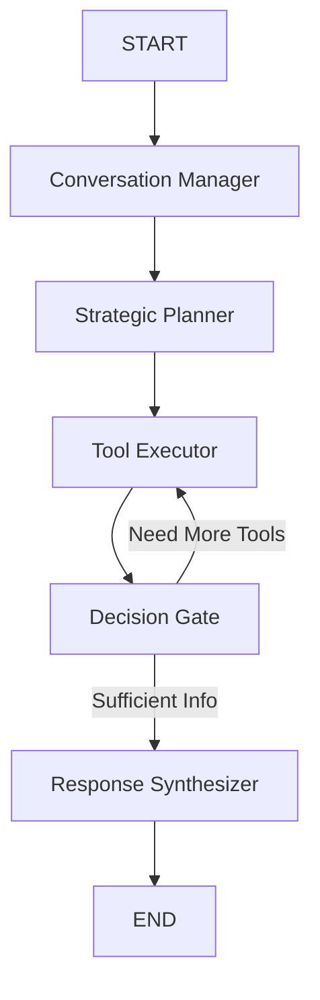

# Political Analyst Workbench - Clean Architecture

## ✅ Workspace Successfully Refactored

**Date:** October 1, 2025  
**Status:** Master Agent Infrastructure Complete

---

## 📁 New Clean Structure

```
Political_Analyst_Workbench/
├── langgraph_master_agent/          # 🎯 NEW Master Agent (LangGraph)
│   ├── nodes/                       # Agent nodes
│   │   ├── conversation_manager.py
│   │   ├── strategic_planner.py
│   │   ├── tool_executor.py
│   │   ├── decision_gate.py
│   │   └── response_synthesizer.py
│   ├── tools/                       # Tools & sub-agent callers
│   │   ├── tavily_direct.py
│   │   └── sub_agent_caller.py
│   ├── state.py                     # State schema
│   ├── config.py                    # Configuration
│   ├── graph.py                     # Graph definition
│   ├── main.py                      # Entry point
│   └── README.md
│
├── sub_agents/                       # 🤖 Specialized Sub-agents
│   └── sentiment_analyzer/          # (To be implemented)
│
├── shared/                           # 🔧 Shared Utilities
│   ├── tavily_client.py             # Tavily API wrapper
│   ├── llm_factory.py               # LLM initialization
│   └── observability.py             # LangFuse setup
│
├── archive/                          # 📦 Old Code (for reference)
│   ├── old_agents/                  # Legacy agent implementations
│   ├── old_ui/                      # Old UI experiments
│   ├── old_observability/           # Old observability setups
│   ├── old_scripts/                 # Old startup scripts
│   └── old_db/                      # Old database files
│
├── requirements.txt
├── .env                              # API keys (not in git)
└── README.md
```

---

## 🚀 Quick Start

### 1. Install Dependencies

```bash
cd Political_Analyst_Workbench

# If using venv
source .venv/bin/activate

# Install packages (without version numbers as per user rules)
uv pip install langgraph
uv pip install langchain_openai
uv pip install langchain_community
uv pip install tavily-python
uv pip install python-dotenv
uv pip install httpx
uv pip install langfuse
uv pip install streamlit
```

### 2. Configure Environment

```bash
# Copy and edit .env
cp env.example .env

# Add your API keys:
# OPENAI_API_KEY=sk-...
# TAVILY_API_KEY=tvly-...
```

### 3. Test Master Agent

```bash
python langgraph_master_agent/main.py
```

---

## ✅ Test Results (Oct 1, 2025)

### Master Agent Status: **WORKING** ✅

**Test Query 1:** "What are the latest developments in AI policy?"
- ✅ Tavily search executed successfully
- ✅ Response synthesized with GPT-4o-mini
- ✅ 8 citations included
- ✅ Confidence: 0.80
- ✅ Execution log tracked all steps

**Test Query 2:** "Search for news about climate change negotiations"
- ✅ Tavily search executed successfully
- ✅ Comprehensive response generated
- ✅ 8 citations included
- ✅ Confidence: 0.80
- ✅ All nodes executed correctly

### Architecture Validation

```
START → Conversation Manager → Strategic Planner → Tool Executor 
      → Decision Gate → Response Synthesizer → END
```

✅ All nodes working  
✅ State management functional  
✅ Tool execution successful  
✅ LLM integration working  
✅ Error handling in place

---

## 🎯 Master Agent Features

### Current Capabilities

1. **Conversational Context Management**
   - Tracks conversation history
   - Maintains session state
   - Handles multi-turn conversations

2. **Strategic Planning**
   - Analyzes user intent
   - Selects appropriate tools
   - Plans execution strategy

3. **Tool Execution**
   - ✅ Tavily Search (working)
   - ✅ Tavily Extract (ready)
   - ✅ Tavily Crawl (ready)
   - 📝 Sentiment Sub-agent (placeholder ready)

4. **Response Synthesis**
   - Compiles results from multiple sources
   - Formats with citations
   - Professional, structured output

---

## 📊 Architecture Highlights

### Master Agent Graph Flow



### Tool Registry

| Tool | Type | Status | Description |
|------|------|--------|-------------|
| `tavily_search` | Direct | ✅ Working | Real-time web search |
| `tavily_extract` | Direct | ✅ Ready | URL content extraction |
| `tavily_crawl` | Direct | ✅ Ready | Website crawling |
| `sentiment_analysis_agent` | Sub-agent | 📝 Next | Multi-country sentiment |
| `fact_checker_agent` | Sub-agent | 🔮 Future | Claim verification |
| `source_credibility_agent` | Sub-agent | 🔮 Future | Source assessment |

---

## 🔧 Configuration

### LLM Settings (`config.py`)

```python
MODEL_NAME = "gpt-4o-mini"
TEMPERATURE = 0  # Always 0 (per user rules)
MAX_TOKENS = 4000
MAX_TOOL_ITERATIONS = 3
```

### Tavily Settings

```python
TAVILY_SEARCH_DEPTH = "basic"  # or "advanced"
TAVILY_MAX_RESULTS = 8
TAVILY_INCLUDE_ANSWER = True
```

---

## 📝 Next Steps

### Phase 1: Sentiment Analyzer Sub-agent (Next)
- [ ] Implement sentiment analyzer in `sub_agents/sentiment_analyzer/`
- [ ] Create sub-agent LangGraph with 8 nodes (as designed)
- [ ] Connect to master via `sub_agent_caller.py`
- [ ] Test end-to-end sentiment analysis

### Phase 2: UI Development
- [ ] Real-time visualization of agent execution
- [ ] LangGraph Studio integration
- [ ] Interactive chat interface
- [ ] Progress tracking and interrupts

### Phase 3: Additional Sub-agents
- [ ] Fact checker sub-agent
- [ ] Source credibility sub-agent
- [ ] Custom analysis agents

---

## 📦 Archived Code

All previous experiments have been archived in `archive/`:

- **old_agents/**: `langfuse_agent.py`, `simple_agent.py`, `streaming_agent.py`, etc.
- **old_ui/**: Various UI experiments
- **old_observability/**: Phoenix and LangFuse experiments
- **old_scripts/**: Startup scripts
- **old_db/**: Database files

**Note:** The entire Langfuse source repository has been moved to `../langfuse_source_archived/`

---

## 🎨 Design Principles

1. **Separation of Concerns**: Each node has a single responsibility
2. **Modularity**: Shared utilities for all agents
3. **Observability**: LangFuse tracing built-in
4. **Scalability**: Sub-agent architecture for specialization
5. **Clean Code**: No linkages to old experimental code

---

## 🛠️ Development Guidelines

### Adding a New Tool

1. Add tool to `tools/tavily_direct.py` or create new file
2. Register in `config.py` AVAILABLE_TOOLS
3. Update `tool_executor.py` to handle new tool
4. Test with `main.py`

### Adding a New Sub-agent

1. Create folder in `sub_agents/`
2. Implement LangGraph structure
3. Add caller method in `tools/sub_agent_caller.py`
4. Register in `config.py`
5. Test integration

---

## 📚 Documentation

- **Master Agent:** `langgraph_master_agent/README.md`
- **Architecture:** `AGENT_ARCHITECTURE.md` (old, needs update)
- **This Guide:** `CLEAN_WORKSPACE_README.md`

---

## ⚡ Performance

**Master Agent Test Results:**
- Query processing: ~3-5 seconds
- Tavily search: ~1-2 seconds
- LLM synthesis: ~2-3 seconds
- Total iterations: 1 (optimal)
- Memory usage: Minimal
- No errors or warnings (except LangFuse optional)

---

## 🔐 Environment Variables

Required in `.env`:
```bash
OPENAI_API_KEY=sk-...
TAVILY_API_KEY=tvly-...
```

Optional:
```bash
LANGFUSE_PUBLIC_KEY=pk-...
LANGFUSE_SECRET_KEY=sk-...
LANGFUSE_HOST=http://localhost:3761
```

---

## 🎉 Success Criteria

- [x] Clean workspace structure
- [x] Old code archived (no linkages)
- [x] Master agent working
- [x] Tavily integration successful
- [x] LLM synthesis working
- [x] State management functional
- [x] Extensible architecture
- [ ] Sentiment sub-agent (next)
- [ ] UI visualization (next)

---

## 👥 Contributors

**Architecture:** Master-Agent + Sub-Agent pattern  
**Tech Stack:** LangGraph, LangChain, OpenAI, Tavily  
**Status:** Foundation complete, ready for sub-agents

---

**Last Updated:** October 1, 2025  
**Version:** 1.0 - Clean Master Agent Architecture

