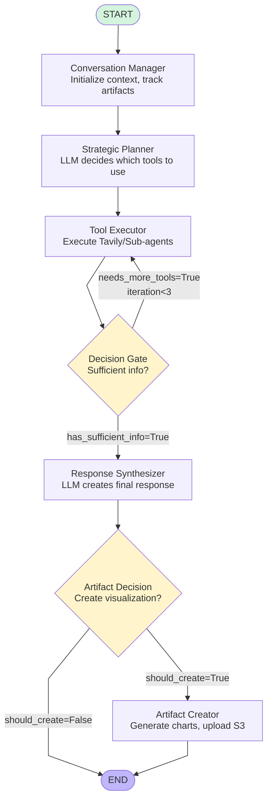

# Detailed Execution Graph with Decisions and Data Flow

## Graph Structure (Mermaid)



---

## Detailed Node-by-Node Data Flow

### Node 1: Conversation Manager

**File:** `nodes/conversation_manager.py`

```
INPUT:
├── current_message: User query string
├── conversation_history: List of previous messages (or empty)
└── artifact_id: From previous turn (if any)

PROCESSING:
├── Initialize conversation_history if empty
├── Add current user message to history
├── Create session_id if new
├── Track artifacts from previous turn → artifacts_history[]
└── Trim history to last 10 messages

OUTPUT (passed to next node):
├── conversation_history: [all messages]
├── session_id: "session_12345"
├── artifacts_history: [tracked artifacts]
└── execution_log: [+ context initialized entry]

DECISIONS: None (pure state management)
```

---

### Node 2: Strategic Planner

**File:** `nodes/strategic_planner.py`

```
INPUT (from Conversation Manager):
├── current_message: User query
├── conversation_history: All previous messages
└── Available tools config

PROCESSING:
├── Build context from last 3 conversation messages
├── Create planning prompt with AVAILABLE_TOOLS
├── LLM Call (gpt-4o, temp=0):
│   ├── Prompt: "Analyze query and select tools..."
│   ├── Input: Query + history + available tools
│   └── Output: JSON with tools_to_use
├── Parse LLM JSON response
├── Extract tools_to_use array
└── [FALLBACK DISABLED] Keyword matching commented out

OUTPUT (passed to Tool Executor):
├── tools_to_use: ["tavily_search", "sentiment_agent", ...]
├── task_plan: Full LLM reasoning
├── reasoning: Brief explanation
└── execution_log: [+ plan created entry]

DECISIONS:
└── Which tools to execute (LLM-based)

EXAMPLE TURN 1:
Input: "how has india been affected by US tariffs"
Decision: tools_to_use = ["tavily_search", "sentiment_analysis_agent"]

EXAMPLE TURN 2:
Input: "create a trend visualization of this data"
Decision: tools_to_use = ["tavily_search", "tavily_extract"]
Issue: ⚠️ Should have recognized artifact creation intent
```

---

### Node 3: Tool Executor

**File:** `nodes/tool_executor.py`

```
INPUT (from Strategic Planner):
├── tools_to_use: Array of tool names
├── current_message: User query
└── Additional params (countries, time_range, etc.)

PROCESSING:
For each tool in tools_to_use:
  
  ├── tavily_search:
  │   ├── Call Tavily API (depth=basic, max_results=8)
  │   ├── Search query = current_message
  │   └── Store in tool_results["tavily_search"]
  │
  ├── tavily_extract:
  │   ├── Get URLs from state.urls_to_extract
  │   ├── Extract content from each URL
  │   └── Store in tool_results["tavily_extract"]
  │
  └── sentiment_analysis_agent:
      ├── Call sub-agent via SubAgentCaller
      ├── Pass query, countries, time_range_days
      └── Store in sub_agent_results["sentiment_analysis"]

OUTPUT (passed to Decision Gate):
├── tool_results: {
│   "tavily_search": {success: true, results: [...], result_count: 8},
│   "tavily_extract": {success: true, extracted: [...]}
│   }
├── sub_agent_results: {
│   "sentiment_analysis": {sentiment_scores: {...}}
│   }
└── execution_log: [+ tool execution entries]

DECISIONS: None (pure execution)

EXAMPLE TURN 1:
Executes: tavily_search + sentiment_analysis_agent
Results: 8 Tavily articles + sentiment data

EXAMPLE TURN 2:
Executes: tavily_search + tavily_extract
Results: 8 articles about "how to visualize"
Issue: ⚠️ Wrong tools - should have been artifact creation
```

---

### Node 4: Decision Gate

**File:** `nodes/decision_gate.py`

```
INPUT (from Tool Executor):
├── tool_results: Dict of tool outputs
├── sub_agent_results: Dict of sub-agent outputs
├── iteration_count: Current iteration number
└── MAX_TOOL_ITERATIONS: 3 (from config)

PROCESSING:
├── Increment iteration_count
├── Check: has_results = bool(tool_results or sub_agent_results)
├── Check: at_iteration_limit = (iteration_count >= 3)
│
└── Decision Logic:
    ├── IF has_results AND iteration >= 1:
    │   └── DECISION: PROCEED_TO_SYNTHESIS
    │
    ├── ELIF no results AND iteration < 3:
    │   └── DECISION: RETRY_TOOLS (loop back)
    │
    └── ELSE:
        └── DECISION: PROCEED_TO_SYNTHESIS (with what we have)

OUTPUT (routing decision):
├── has_sufficient_info: True/False
├── needs_more_tools: True/False (controls loop)
├── needs_clarification: True/False
├── iteration_count: Updated count
└── execution_log: [+ decision entry]

DECISIONS:
└── ROUTE: Loop to tool_executor OR continue to response_synthesizer

ROUTING LOGIC:
┌─────────────────────────────────────┐
│  needs_more_tools = True?           │
│  └─> Loop back to Tool Executor     │
│                                     │
│  has_sufficient_info = True?        │
│  └─> Continue to Response Synth     │
└─────────────────────────────────────┘

EXAMPLE (Both Turns):
Input: has_results=True, iteration=1
Decision: PROCEED_TO_SYNTHESIS
Output: needs_more_tools=False, has_sufficient_info=True
```

---

### Node 5: Response Synthesizer

**File:** `nodes/response_synthesizer.py`

```
INPUT (from Decision Gate):
├── current_message: User query
├── tool_results: All tool outputs
├── sub_agent_results: All sub-agent outputs
└── conversation_history: Full message history (KEY!)

PROCESSING:
├── Build conversation context (last 5 messages)
│   Important: This includes previous assistant responses!
│
├── Compile all results into summary:
│   ├── Tool results with sources
│   └── Sub-agent results
│
├── Create synthesis prompt:
│   ├── CONVERSATION HISTORY (last 5 messages)
│   ├── USER QUERY
│   ├── GATHERED INFORMATION (tool results)
│   └── TASK: Create comprehensive response
│
├── LLM Call (gpt-4o, temp=0):
│   └── Generate structured, cited response
│
├── Extract citations from tool results
├── Calculate confidence score (0.8 if has results, else 0.3)
└── Add assistant response to conversation_history

OUTPUT (passed to Artifact Decision):
├── final_response: Full text response
├── citations: [{title, url, source}, ...]
├── confidence_score: 0.0-1.0
├── conversation_history: [+ new assistant message]
└── execution_log: [+ synthesis entry]

DECISIONS: None (synthesis only)

EXAMPLE TURN 1:
Input: Tavily results + sentiment data
Output: "### Impact of US Tariffs on India..." (1976 chars, 8 citations)

EXAMPLE TURN 2:
Input: Articles about visualization + Turn 1 full context
Output: "### Trend Visualization of US Tariffs..." (guidance)
Note: ✅ Conversation history includes all Turn 1 data
```

---

### Node 6: Artifact Decision

**File:** `nodes/artifact_decision.py`

```
INPUT (from Response Synthesizer):
├── current_message: User query
├── final_response: Generated text response
└── conversation_history: FULL history with all previous data

PROCESSING:
Step 1: Keyword Detection
├── Check message for: ["chart", "graph", "visualiz", "plot", "show", "create"]
├── explicit_request = True/False
└── If False → SKIP (no artifact)

Step 2: LLM-based Data Extraction
├── Build extraction prompt:
│   ├── CONVERSATION HISTORY (last 5 messages)
│   │   └─> Includes previous responses with data!
│   ├── Current User Query
│   ├── Agent's Response
│   └── TASK: Extract structured data for visualization
│
├── LLM Call (gpt-4o, temp=0):
│   ├── Prompt: "Extract data from conversation..."
│   ├── Important: Can look in HISTORY for data
│   └── Output: JSON with chart_type and data
│
└── Parse JSON response

Step 3: Validation
├── Check if data is valid
├── Determine chart type (line_chart, bar_chart, mind_map)
└── Set should_create_artifact flag

OUTPUT (routing decision):
├── should_create_artifact: True/False
├── artifact_type: "line_chart" | "bar_chart" | "mind_map" | None
├── artifact_data: {x: [...], y: [...], labels: ...}
├── artifact_title: String
└── execution_log: [+ artifact decision entry]

DECISIONS:
└── ROUTE: Create artifact OR skip to END

ROUTING LOGIC:
┌────────────────────────────────────┐
│  should_create_artifact = True?    │
│  └─> Route to Artifact Creator     │
│                                    │
│  should_create_artifact = False?   │
│  └─> Route to END                  │
└────────────────────────────────────┘

EXAMPLE TURN 1:
Input: "how has india been affected by US tariffs"
Keyword check: No viz keywords → explicit_request=False
Decision: should_create_artifact=False
Route: → END

EXAMPLE TURN 2:
Input: "create a trend visualization of this data"
Keyword check: "create", "visualiz" found → explicit_request=True
LLM extraction:
  - Looks in conversation history for Turn 1 data
  - Finds: "Textiles affected", "$48.2B", but no time series
  - Tries to extract: x=[2020-2025], y=[null, null, ...]
Decision: should_create_artifact=True, artifact_type="line_chart"
Issue: ⚠️ y-values are null (qualitative source data)
Route: → Artifact Creator
```

---

### Node 7: Artifact Creator

**File:** `nodes/artifact_creator.py`

```
INPUT (from Artifact Decision):
├── artifact_type: "line_chart" | "bar_chart" | "mind_map"
├── artifact_data: {x: [...], y: [...], labels: ...}
├── artifact_title: String
└── current_message: User query

PROCESSING:
Step 1: Data Preparation
├── Match data format to chart type
├── Apply defaults if data incomplete
└── Generate artifact_id (unique hash)

Step 2: Chart Creation
├── Use Plotly to create interactive chart:
│   ├── LineChartTool.create() for line_chart
│   ├── BarChartTool.create() for bar_chart
│   └── MindMapTool.create() for mind_map
│
├── Generate files:
│   ├── HTML: Interactive Plotly chart
│   └── PNG: Static image export
│
└── Save locally to artifacts/ directory

Step 3: S3 Upload (if available)
├── Upload HTML to S3 (private bucket, encrypted)
├── Upload PNG to S3 (private bucket, encrypted)
├── Generate presigned URLs (24h expiration)
└── Store S3 keys and URLs in artifact metadata

Step 4: MongoDB Save (optional)
└── Save artifact metadata to database

OUTPUT (final artifact):
├── artifact: {
│   artifact_id: "line_abc123",
│   type: "line_chart",
│   title: "...",
│   html_path: "artifacts/.../chart.html",
│   png_path: "artifacts/.../chart.png",
│   s3_html_key: "artifacts/line_chart/.../chart.html",
│   s3_png_key: "artifacts/line_chart/.../chart.png",
│   s3_html_url: "https://...?presigned...",
│   s3_png_url: "https://...?presigned...",
│   storage: "s3",
│   query: "original user query",
│   sources: [...citations...],
│   session_id: "..."
│   }
├── artifact_id: "line_abc123"
└── execution_log: [+ artifact created entry]

DECISIONS: None (creation only)

EXAMPLE TURN 2:
Input: line_chart, data={x:[2020-2025], y:[null...]}
Creates: Line chart (but with no visible data)
Uploads: ✅ To S3 successfully
Output: artifact_id="line_c91866249d6c"
Issue: ⚠️ Should validate data before creating empty chart
```

---

## Complete Data Flow Example (Turn 2)

### User Query: "create a trend visualization of this data"

```
┌─────────────────────────────────────────────────────────────────┐
│ CONVERSATION MANAGER                                             │
│ ─────────────────────────────────────────────────────────────── │
│ Input:  current_message = "create a trend..."                   │
│         conversation_history = [Turn 1: user+assistant]          │
│                                                                  │
│ Output: conversation_history = [Turn 1 + new user message]      │
│         └─> [user₁, assistant₁, user₂] (3 messages)            │
└─────────────────────────────────────────────────────────────────┘
                              ↓
┌─────────────────────────────────────────────────────────────────┐
│ STRATEGIC PLANNER                                                │
│ ─────────────────────────────────────────────────────────────── │
│ Input:  current_message = "create a trend..."                   │
│         conversation_history = [user₁, assistant₁, user₂]       │
│         AVAILABLE_TOOLS = [tavily_search, sentiment_agent]       │
│                                                                  │
│ LLM Prompt:                                                      │
│   "CONVERSATION HISTORY:                                         │
│    user: how has india been affected by US tariffs               │
│    assistant: ### Impact of US Tariffs...                        │
│                                                                  │
│    CURRENT MESSAGE: create a trend visualization..."            │
│                                                                  │
│ LLM Decision: tools_to_use = ["tavily_search", "tavily_extract"]│
│ Issue: ⚠️ Doesn't know about artifact creation capability       │
│                                                                  │
│ Output: tools_to_use = ["tavily_search", "tavily_extract"]      │
└─────────────────────────────────────────────────────────────────┘
                              ↓
┌─────────────────────────────────────────────────────────────────┐
│ TOOL EXECUTOR                                                    │
│ ─────────────────────────────────────────────────────────────── │
│ Input:  tools_to_use = ["tavily_search", "tavily_extract"]      │
│         current_message = "create a trend..."                   │
│                                                                  │
│ Executes:                                                        │
│   1. tavily_search("create a trend visualization...")           │
│      └─> 8 articles about HOW to visualize                      │
│   2. tavily_extract(urls)                                        │
│      └─> Extracted content about visualization                  │
│                                                                  │
│ Output: tool_results = {                                         │
│           "tavily_search": {8 articles},                         │
│           "tavily_extract": {extracted content}                  │
│         }                                                        │
└─────────────────────────────────────────────────────────────────┘
                              ↓
┌─────────────────────────────────────────────────────────────────┐
│ DECISION GATE                                                    │
│ ─────────────────────────────────────────────────────────────── │
│ Input:  has_results = True (tool_results exist)                 │
│         iteration_count = 1                                      │
│                                                                  │
│ Logic:  if has_results AND iteration >= 1:                      │
│           → PROCEED_TO_SYNTHESIS                                 │
│                                                                  │
│ Decision: needs_more_tools = False                              │
│           has_sufficient_info = True                             │
│                                                                  │
│ Output: Route to Response Synthesizer                           │
└─────────────────────────────────────────────────────────────────┘
                              ↓
┌─────────────────────────────────────────────────────────────────┐
│ RESPONSE SYNTHESIZER                                             │
│ ─────────────────────────────────────────────────────────────── │
│ Input:  current_message = "create a trend..."                   │
│         conversation_history = [user₁, assistant₁, user₂]       │
│         tool_results = {articles about visualization}            │
│                                                                  │
│ LLM Prompt:                                                      │
│   "CONVERSATION HISTORY:                                         │
│    USER: how has india been affected by US tariffs               │
│    ASSISTANT: ### Impact of US Tariffs on India                  │
│               - Textiles and Gems: affected                      │
│               - $48.2 billion threatened                         │
│               - Pharmaceuticals: relatively unaffected           │
│                                                                  │
│    USER: create a trend visualization of this data               │
│                                                                  │
│    GATHERED INFO: [articles about chart types]                  │
│                                                                  │
│    TASK: Create comprehensive response...                       │
│    IMPORTANT: If user says 'create chart for this',             │
│              extract data from conversation history"             │
│                                                                  │
│ LLM Output: "### Trend Visualization...                         │
│              Use line charts, bump charts...                     │
│              Data points to consider: Textiles..."               │
│                                                                  │
│ Output: final_response = "### Trend Visualization..." (1961 ch) │
│         citations = [8 visualization articles]                   │
│         confidence_score = 0.8                                   │
│         conversation_history += assistant message                │
└─────────────────────────────────────────────────────────────────┘
                              ↓
┌─────────────────────────────────────────────────────────────────┐
│ ARTIFACT DECISION                                                │
│ ─────────────────────────────────────────────────────────────── │
│ Input:  current_message = "create a trend visualization..."     │
│         final_response = "### Trend Visualization..." (guidance) │
│         conversation_history = [all 4 messages]                  │
│                                                                  │
│ Step 1: Keyword Check                                            │
│   Keywords found: "create" ✅, "visualiz" ✅                     │
│   → explicit_request = True                                      │
│                                                                  │
│ Step 2: LLM Data Extraction                                      │
│   LLM Prompt:                                                    │
│     "CONVERSATION HISTORY:                                       │
│      USER: how has india been affected by US tariffs             │
│      ASSISTANT: Impact of US Tariffs on India...                 │
│                 - Textiles affected                              │
│                 - $48.2 billion threatened                       │
│      USER: create a trend visualization of this data             │
│      ASSISTANT: [guidance about chart types]                     │
│                                                                  │
│      TASK: Extract structured data for visualization             │
│      Look in CONVERSATION HISTORY if user refers to 'this'"      │
│                                                                  │
│   LLM Output:                                                    │
│     {                                                            │
│       "should_create": true,                                     │
│       "chart_type": "line_chart",                                │
│       "data": {                                                  │
│         "x": ["2020", "2021", "2022", "2023", "2024", "2025"],  │
│         "y": [null, null, null, null, null, null],              │
│         "x_label": "Year",                                       │
│         "y_label": "Export Value Impact"                         │
│       },                                                         │
│       "title": "Impact of US Tariffs on India's Export Sectors"  │
│     }                                                            │
│                                                                  │
│ Analysis: ✅ Detected visualization need                         │
│           ⚠️  y-values null (Turn 1 had no time series data)    │
│                                                                  │
│ Output: should_create_artifact = True                           │
│         artifact_type = "line_chart"                             │
│         artifact_data = {x:[years], y:[null...]}                 │
│         Route to → Artifact Creator                              │
└─────────────────────────────────────────────────────────────────┘
                              ↓
┌─────────────────────────────────────────────────────────────────┐
│ ARTIFACT CREATOR                                                 │
│ ─────────────────────────────────────────────────────────────── │
│ Input:  artifact_type = "line_chart"                             │
│         artifact_data = {x:[2020-2025], y:[null,null...]}        │
│         artifact_title = "Impact of US Tariffs..."               │
│                                                                  │
│ Processing:                                                      │
│   1. Create Plotly line chart                                    │
│      - X-axis: ["2020", "2021", ..., "2025"]                    │
│      - Y-axis: [null, null, ..., null]                          │
│      - Result: Chart with no visible data points                 │
│                                                                  │
│   2. Generate files:                                             │
│      - HTML: artifacts/line_c91866249d6c/line_c91866249d6c.html │
│      - PNG:  artifacts/line_c91866249d6c/line_c91866249d6c.png  │
│                                                                  │
│   3. Upload to S3:                                               │
│      - Bucket: political-analyst-artifacts (private, encrypted)  │
│      - HTML uploaded ✅                                          │
│      - PNG uploaded ✅                                           │
│      - Presigned URLs generated (24h validity) ✅                │
│                                                                  │
│ Output: artifact = {                                             │
│           artifact_id: "line_c91866249d6c",                      │
│           type: "line_chart",                                    │
│           html_path: "...",                                      │
│           png_path: "...",                                       │
│           s3_html_url: "https://...?X-Amz...",                   │
│           s3_png_url: "https://...?X-Amz...",                    │
│           storage: "s3"                                          │
│         }                                                        │
│                                                                  │
│ Status: ✅ Technical success (files created, uploaded)           │
│         ⚠️  Content issue (chart is empty)                      │
└─────────────────────────────────────────────────────────────────┘
                              ↓
                            [END]
```

---

## Key Insights for Debugging

### ✅ What's Working
1. **Conversation context flows perfectly** - Each node sees full history
2. **Artifact detection working** - Keywords detected, creation triggered
3. **S3 integration flawless** - Upload, encryption, presigned URLs
4. **State management solid** - Data passes correctly between nodes

### ⚠️ Issues Identified
1. **Strategic Planner** - Doesn't know about artifact creation capability
   - Fix: Add to AVAILABLE_TOOLS in config.py
   
2. **Data extraction** - Tries to create line chart from qualitative data
   - Fix: Better data type validation and chart type matching
   
3. **Empty chart creation** - Creates chart even with null values
   - Fix: Add validation before Plotly creation

### 🔄 Decision Points Summary

| Node | Decision Type | Current Logic | Issue |
|------|--------------|---------------|-------|
| Strategic Planner | Tool Selection | LLM-based (no fallback) | ⚠️ Missing artifact creation awareness |
| Decision Gate | Loop or Continue | has_results & iteration check | ✅ Working correctly |
| Artifact Decision | Create or Skip | Keyword + LLM extraction | ⚠️ Extracts null values |
| Routing | Path selection | Boolean flags | ✅ Working correctly |

---

## Files Generated

1. **graph_structure.md** - Mermaid diagram (basic structure)
2. **DETAILED_EXECUTION_GRAPH.md** - This file (detailed with decisions)
3. **EXECUTION_FLOW_LOG.md** - Visual flowchart with test data
4. **AGENT_DEBUG_ANALYSIS.md** - Complete node-by-node analysis

To view the Mermaid diagram interactively:
1. Copy the mermaid code above
2. Paste into https://mermaid.live
3. Or view in any Markdown viewer that supports Mermaid

