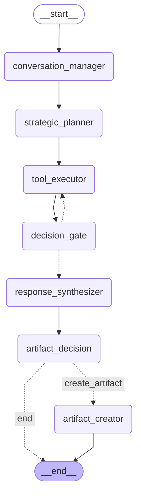

# Master Agent Graph Structure

```mermaid
---
config:
  flowchart:
    curve: linear
---
graph TD;
	__start__([<p>__start__</p>]):::first
	conversation_manager(conversation_manager)
	strategic_planner(strategic_planner)
	tool_executor(tool_executor)
	decision_gate(decision_gate)
	response_synthesizer(response_synthesizer)
	artifact_decision(artifact_decision)
	artifact_creator(artifact_creator)
	__end__([<p>__end__</p>]):::last
	__start__ --> conversation_manager;
	artifact_decision -. &nbsp;end&nbsp; .-> __end__;
	artifact_decision -. &nbsp;create_artifact&nbsp; .-> artifact_creator;
	conversation_manager --> strategic_planner;
	decision_gate -.-> response_synthesizer;
	decision_gate -.-> tool_executor;
	response_synthesizer --> artifact_decision;
	strategic_planner --> tool_executor;
	tool_executor --> decision_gate;
	artifact_creator --> __end__;
	classDef default fill:#f2f0ff,line-height:1.2
	classDef first fill-opacity:0
	classDef last fill:#bfb6fc

```
