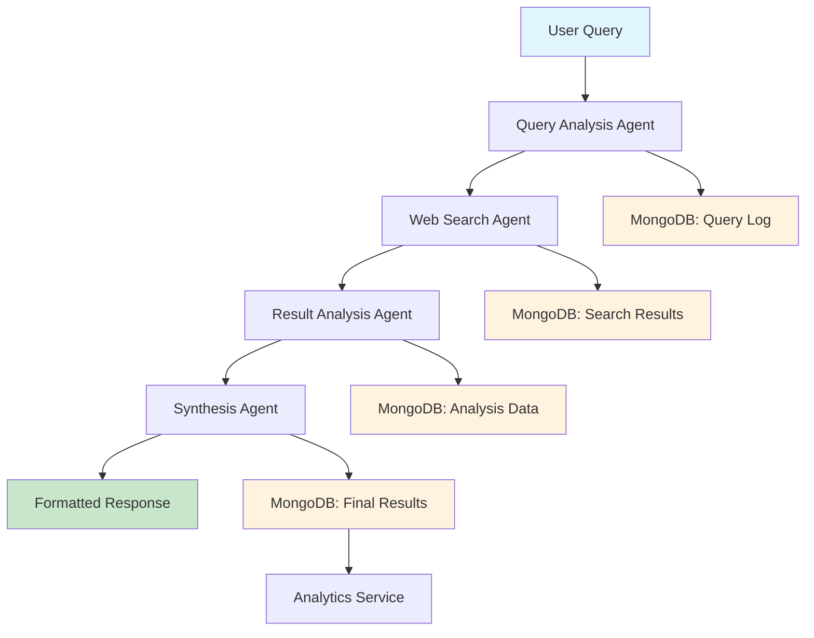

# System Architecture Guide

## 🏗 **Multi-Agent Architecture Overview**

The Web Research Agent is built on a sophisticated multi-agent architecture using LangGraph for orchestration and Tavily API for web search capabilities. This design ensures modularity, scalability, and clear separation of concerns.

## 🤖 **Agent Workflow**

### **Visual Architecture**


## 🎯 **Agent Roles & Responsibilities**

### **1. Query Analysis Agent**
**Purpose:** Extract effective search terms from user queries
- **Input:** Raw user query string
- **Output:** 2-3 optimized search terms
- **Processing Time:** ~2-3 seconds
- **LLM Integration:** OpenAI GPT-4 for intelligent term extraction

**Implementation:**
```python
def _analyze_query(self, state: ResearchState) -> Dict[str, Any]:
    query = state["query"]
    
    analysis_prompt = f"""
    Analyze this query and extract 2-3 key search terms:
    Query: "{query}"
    
    Consider:
    1. Main topic or subject
    2. Specific aspects or subtopics
    3. Current/recent developments if relevant
    
    Return only the search terms, one per line.
    """
    
    response = self.llm.invoke([
        SystemMessage(content="You are a research assistant specializing in query analysis."),
        HumanMessage(content=analysis_prompt)
    ])
    
    search_terms = [term.strip() for term in response.content.split('\n') if term.strip()]
    return {"search_terms": search_terms[:3]}  # Limit to 3 terms
```

### **2. Web Search Agent**
**Purpose:** Perform comprehensive web searches using Tavily API
- **Input:** Search terms from Query Analysis Agent
- **Output:** Raw search results with metadata
- **Processing Time:** ~15-25 seconds
- **API Integration:** Tavily advanced search with 5 results per term

**Implementation:**
```python  
def _search_web(self, state: ResearchState) -> Dict[str, Any]:
    search_terms = state["search_terms"]
    all_results = []
    
    for term in search_terms:
        try:
            search_response = self.tavily_client.search(
                query=term,
                search_depth="advanced", 
                max_results=5,
                include_answer=True,
                include_raw_content=True,
                include_domains=None,
                exclude_domains=["wikipedia.org"]  # Prefer primary sources
            )
            
            for result in search_response.get("results", []):
                processed_result = {
                    "title": result.get("title", ""),
                    "url": result.get("url", ""),
                    "content": result.get("content", ""),
                    "score": result.get("score", 0),
                    "search_term": term,
                    "published_date": result.get("published_date"),
                    "raw_content": result.get("raw_content", "")[:1000]  # Limit size
                }
                all_results.append(processed_result)
                
        except Exception as e:
            logger.error(f"Search failed for term '{term}': {e}")
            continue
    
    return {"search_results": all_results}
```

### **3. Result Analysis Agent**
**Purpose:** Filter and analyze search results for relevance and quality
- **Input:** Raw search results from Web Search Agent
- **Output:** Structured analysis with key findings and relevance scores
- **Processing Time:** ~10-15 seconds
- **LLM Integration:** OpenAI GPT-4 for content analysis

**Key Functions:**
- **Relevance Scoring:** Evaluates each result's relevance to the original query
- **Content Extraction:** Identifies key information from each source
- **Source Credibility:** Assesses the reliability of each source
- **Duplicate Detection:** Removes redundant information

```python
def _analyze_results(self, state: ResearchState) -> Dict[str, Any]:
    query = state["query"]
    search_results = state["search_results"]
    
    analysis_prompt = f"""
    Original Query: "{query}"
    
    Analyze the following search results and extract key information:
    
    {self._format_results_for_analysis(search_results)}
    
    For each result, provide:
    1. Relevance score (0-10)
    2. Key information extracted
    3. Source credibility assessment
    4. How it relates to the original query
    
    Then provide a summary of the most important findings.
    """
    
    response = self.llm.invoke([
        SystemMessage(content="You are an expert research analyst."),
        HumanMessage(content=analysis_prompt)
    ])
    
    return {"analysis": response.content}
```

### **4. Synthesis Agent**
**Purpose:** Create comprehensive formatted responses with proper citations
- **Input:** Analysis from Result Analysis Agent
- **Output:** Final formatted answer with sources
- **Processing Time:** ~15-20 seconds
- **LLM Integration:** OpenAI GPT-4 for synthesis and formatting

**Key Features:**
- **Comprehensive Synthesis:** Combines information from multiple sources
- **Proper Citations:** Includes source references and URLs
- **Structured Formatting:** Uses markdown for clear presentation
- **Confidence Indicators:** Notes limitations and areas needing further research

```python
def _synthesize_answer(self, state: ResearchState) -> Dict[str, Any]:
    query = state["query"]
    analysis = state["analysis"]
    search_results = state["search_results"]
    
    synthesis_prompt = f"""
    Create a comprehensive research response for: "{query}"
    
    Based on this analysis:
    {analysis}
    
    Requirements:
    1. Provide a well-structured, informative response
    2. Include proper citations [1], [2], etc.
    3. Use markdown formatting for clarity
    4. Note any limitations or areas needing further research
    5. Keep response focused and relevant
    
    Format the response professionally with clear sections and conclusions.
    """
    
    response = self.llm.invoke([
        SystemMessage(content="You are an expert research writer."),
        HumanMessage(content=synthesis_prompt)
    ])
    
    # Extract sources for citation list
    sources = self._extract_sources_for_citation(search_results)
    
    return {
        "final_answer": response.content,
        "sources": sources
    }
```

## 🔄 **LangGraph State Management**

### **State Schema**
```python
class ResearchState(TypedDict):
    # Input
    query: str
    user_session: Optional[str]
    
    # Agent outputs
    search_terms: List[str]
    search_results: Annotated[List[Dict[str, Any]], operator.add]
    analysis: str
    final_answer: str
    sources: Annotated[List[str], operator.add]
    
    # Metadata
    processing_start_time: datetime
    current_step: str
    error: Optional[str]
```

### **Graph Construction**
```python
def create_research_graph():
    builder = StateGraph(ResearchState)
    
    # Add agent nodes
    builder.add_node("analyze_query", analyze_query_node)
    builder.add_node("search_web", search_web_node) 
    builder.add_node("analyze_results", analyze_results_node)
    builder.add_node("synthesize_answer", synthesize_answer_node)
    
    # Define workflow edges
    builder.add_edge(START, "analyze_query")
    builder.add_edge("analyze_query", "search_web")
    builder.add_edge("search_web", "analyze_results")  
    builder.add_edge("analyze_results", "synthesize_answer")
    builder.add_edge("synthesize_answer", END)
    
    # Add conditional error handling
    builder.add_conditional_edges(
        "search_web",
        should_retry_search,
        {
            "retry": "search_web",
            "continue": "analyze_results"
        }
    )
    
    return builder.compile()
```

## 🗄 **Database Architecture**

### **MongoDB Collections**

#### **queries Collection**
```javascript
{
  _id: ObjectId,
  query_id: "uuid-string",           // External reference
  query_text: "User's original query",
  user_session: "optional-session-id",
  status: "processing|completed|failed",
  options: {
    max_results: 10,
    search_depth: "advanced",
    export_format: "json"
  },
  created_at: ISODate,
  processing_started_at: ISODate,
  completed_at: ISODate,
  processing_time_ms: Number,
  error_message: String
}
```

#### **results Collection**  
```javascript
{
  _id: ObjectId,
  query_id: "uuid-string",           // Links to queries
  final_answer: "Formatted research response",
  search_terms: ["term1", "term2", "term3"],
  sources: [{
    url: String,
    title: String,
    relevance_score: Number,
    content_snippet: String
  }],
  agent_workflow: [{
    step_name: String,
    duration_ms: Number,
    output_summary: String,
    agent_type: String
  }],
  confidence_score: Number,
  total_sources_found: Number,
  unique_domains: Number,
  created_at: ISODate
}
```

#### **analytics Collection**
```javascript
{
  _id: ObjectId,
  date: ISODate,                     // Daily aggregation
  total_queries: Number,
  completed_queries: Number,
  failed_queries: Number,
  avg_processing_time_ms: Number,
  min_processing_time_ms: Number,
  max_processing_time_ms: Number,
  popular_topics: [String],
  unique_sessions: Number,
  common_errors: {
    "error_type": count
  }
}
```

### **Database Indexes for Performance**
```javascript
// Query collection indexes
db.queries.createIndex({ "query_id": 1 }, { unique: true })
db.queries.createIndex({ "user_session": 1 })
db.queries.createIndex({ "status": 1 })
db.queries.createIndex({ "created_at": -1 })

// Results collection indexes
db.results.createIndex({ "query_id": 1 }, { unique: true })
db.results.createIndex({ "created_at": -1 })
db.results.createIndex({ "search_terms": 1 })

// Analytics collection indexes
db.analytics.createIndex({ "date": 1 }, { unique: true })
```

## 🚀 **Deployment Architecture**

### **AWS Infrastructure Components**

#### **Elastic Beanstalk Configuration**
- **Platform:** Python 3.9 on Amazon Linux 2
- **Instance Type:** t3.small (production), t2.micro (development)
- **Auto Scaling:** 2-10 instances based on CPU utilization
- **Load Balancer:** Application Load Balancer with health checks

```yaml
# .ebextensions/python.config
option_settings:
  aws:elasticbeanstalk:container:python:
    WSGIPath: application.py
  aws:autoscaling:asg:
    MinSize: 2
    MaxSize: 10
    Availability Zones: Any 2
  aws:autoscaling:trigger:
    MeasureName: CPUUtilization
    Unit: Percent
    UpperThreshold: 80
    LowerThreshold: 20
    ScaleUpIncrement: 2
    ScaleDownIncrement: -1
  aws:elasticbeanstalk:healthreporting:system:
    SystemType: enhanced
    HealthCheckSuccessThreshold: Ok
```

#### **CloudFront Distribution**
```json
{
  "Origins": [{
    "Id": "S3-frontend",
    "DomainName": "frontend-bucket.s3.amazonaws.com",
    "S3OriginConfig": {
      "OriginAccessIdentity": ""
    }
  }],
  "DefaultCacheBehavior": {
    "TargetOriginId": "S3-frontend",
    "ViewerProtocolPolicy": "redirect-to-https",
    "CachePolicyId": "managed-caching-optimized",
    "OriginRequestPolicyId": "managed-cors-s3origin"
  },
  "PriceClass": "PriceClass_100",
  "Enabled": true
}
```

### **Security Architecture**

#### **Rate Limiting Implementation**
```python
from flask_limiter import Limiter
from flask_limiter.util import get_remote_address

limiter = Limiter(
    app,
    key_func=get_remote_address,
    default_limits=["100 per minute", "1000 per hour"],
    storage_uri="memory://"
)

@app.route("/research", methods=["POST"])
@limiter.limit("10 per minute")  # Stricter limit for research endpoint
def research():
    # Implementation
    pass
```

#### **Security Headers**
```python
@app.after_request
def security_headers(response):
    response.headers['X-Frame-Options'] = 'DENY'
    response.headers['X-Content-Type-Options'] = 'nosniff'
    response.headers['X-XSS-Protection'] = '1; mode=block'
    response.headers['Strict-Transport-Security'] = 'max-age=31536000; includeSubDomains'
    response.headers['Content-Security-Policy'] = "default-src 'self'"
    return response
```

## 📊 **Performance Characteristics**

### **Timing Breakdown**
| Component | Average Time | P95 Time |
|-----------|-------------|----------|
| Query Analysis | 2-3 seconds | 5 seconds |
| Web Search | 15-25 seconds | 35 seconds |
| Result Analysis | 10-15 seconds | 20 seconds |
| Synthesis | 15-20 seconds | 30 seconds |
| **Total Pipeline** | **45-60 seconds** | **90 seconds** |

### **Scalability Metrics**
- **Concurrent Queries:** 50+ simultaneous
- **Database Connections:** Connection pooling (10-50 connections)
- **Memory Usage:** ~200MB per instance
- **CPU Utilization:** Auto-scales at 80% threshold

## 🔍 **Error Handling & Recovery**

### **Agent-Level Error Handling**
```python
def execute_agent_with_retry(agent_func, state, max_retries=3):
    for attempt in range(max_retries):
        try:
            return agent_func(state)
        except Exception as e:
            if attempt == max_retries - 1:
                return {"error": f"Agent failed after {max_retries} attempts: {str(e)}"}
            time.sleep(2 ** attempt)  # Exponential backoff
```

### **API Error Recovery**
- **Tavily API Failures:** Retry with exponential backoff
- **OpenAI API Failures:** Fallback to cached responses or simplified analysis
- **Database Failures:** Queue operations and retry with circuit breaker pattern

## 🔮 **Future Enhancements**

1. **Multi-Language Support:** Extend agents to handle queries in multiple languages
2. **Specialized Agents:** Add domain-specific agents for scientific, financial, or news research
3. **Real-time Updates:** Implement streaming responses for better user experience
4. **Advanced Analytics:** Machine learning models for query pattern analysis
5. **Federated Search:** Integration with additional search APIs and databases

---

This architecture provides a robust, scalable foundation for multi-agent web research while maintaining clear separation of concerns and comprehensive error handling.
